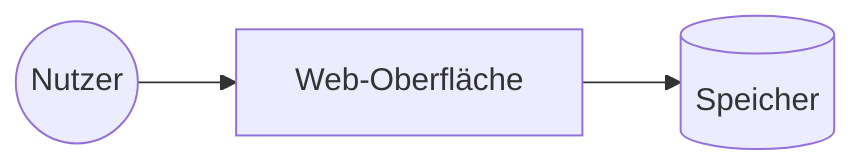

# Architektur: [Name]

```mermaid
flowchart LR
  Nutzer((Nutzer)) --> UI[Web-Oberfläche]
  UI --> DB[(Speicher)]
```

## Entscheidungen

| Entscheidung | Begründung | Alternative |
|---|---|---|

## Offen

- [ ]
